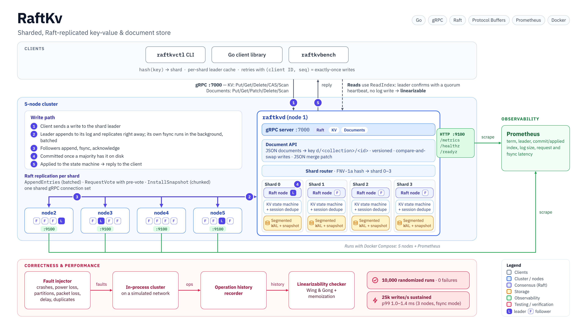
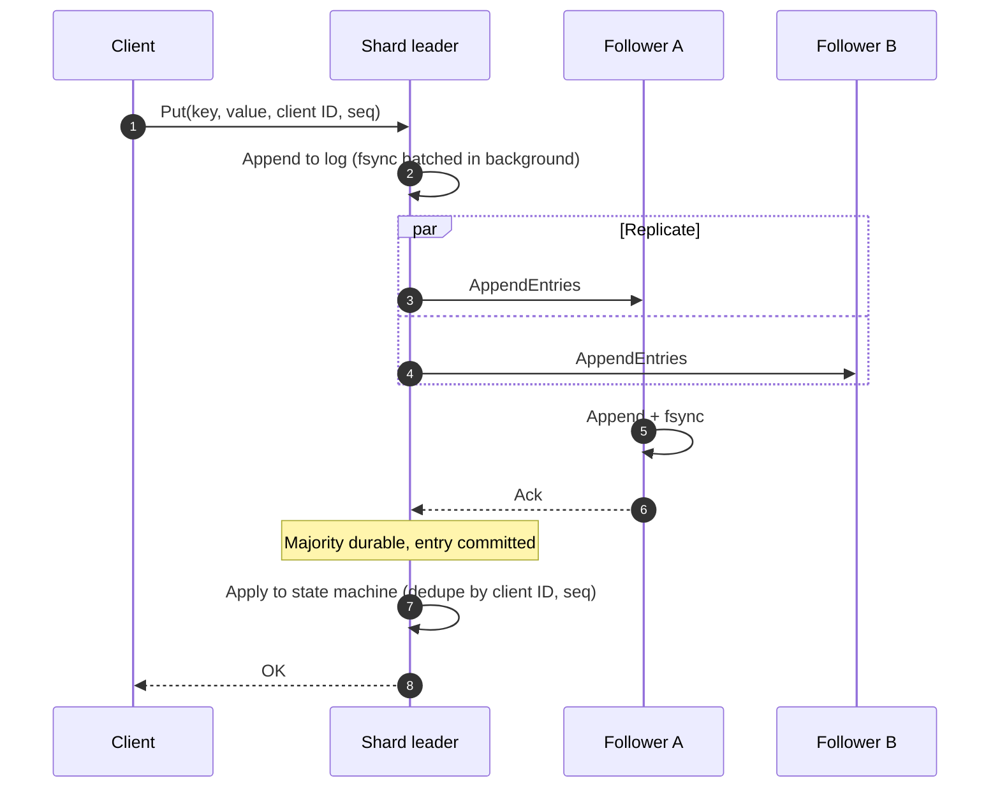
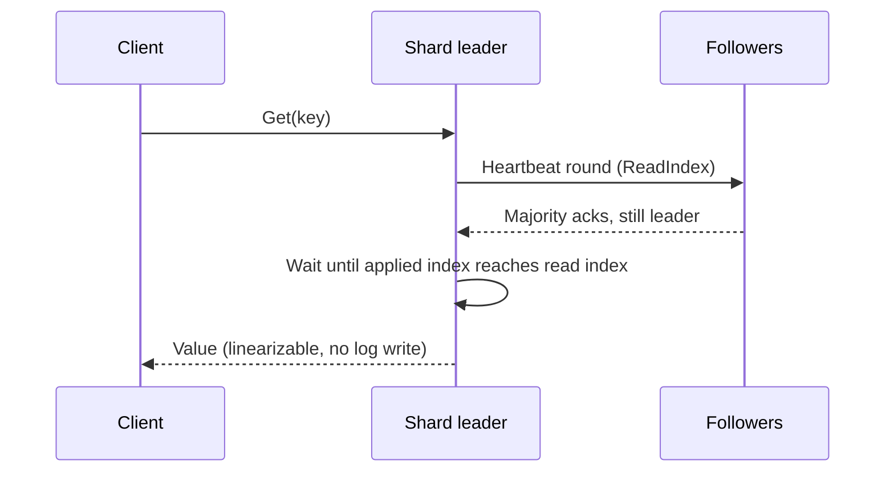

<div align="center">

# RaftKv

**A sharded, Raft-replicated key-value & document store, built from scratch in Go**<br>
**and verified against 10,000 randomized fault-injection runs.**

[](https://go.dev)
[](https://raft.github.io)
[](https://grpc.io)
[](https://prometheus.io)
[](docker-compose.yml)
[](#-verification)
[](#unit-and-integration-tests)

[Architecture](#-architecture) · [Quick start](#-quick-start) · [How it works](#-how-it-works) · [Verification](#-verification) · [Benchmarks](#-benchmarks) · [Layout](#-project-layout)

</div>

<br>

<p align="center">
  
</p>

## Why RaftKv

RaftKv is a complete distributed database in the small. Every layer is written from scratch: Raft consensus, the
write-ahead log, snapshotting, sharding, the document API, the fault-injection harness and the linearizability
checker. The only third-party pieces are gRPC/Protobuf for the wire and the Prometheus client for metrics. It does
not wrap an existing consensus library.

It keeps data consistent when nodes crash, when the network splits, and when every machine loses power at once.
That claim is checked by machine, not taken on faith.

<table>
  <tr>
    <td align="center"><h3>10,000</h3>randomized fault-injection runs<br><b>0 linearizability violations</b></td>
    <td align="center"><h3>256M</h3>client operations checked<br>against 88k injected faults</td>
    <td align="center"><h3>25k writes/s</h3>sustained at p99 1.0–1.4 ms<br><sub>3 nodes, fsync mode¹</sub></td>
    <td align="center"><h3>123k writes/s</h3>peak throughput<br><sub>3 nodes, fsync mode¹</sub></td>
  </tr>
</table>

<sub>¹ Measured on one laptop with all nodes sharing a disk. See [Benchmarks](#-benchmarks) for the durability modes and the full table.</sub>

## ✨ Features

| | |
|---|---|
| 🗳️ **Raft consensus** | Leader election with randomized timeouts and **pre-vote**, log replication with fast conflict backtracking, current-term commit rule, leader no-op, persist-before-reply. |
| ⚡ **Group commit** | The leader replicates before its own fsync and batches fsyncs in the background; it counts itself toward the quorum only up to its durable index. |
| 📖 **Linearizable reads** | **ReadIndex**: the leader confirms leadership with a quorum heartbeat, so reads never touch the log. |
| 🧩 **Sharding** | Keys hash (FNV-1a) to N independent Raft groups, each with its own leader; all groups share one gRPC connection set. |
| 💾 **Durable storage** | Segmented, CRC-checked WAL with torn-write recovery; atomic snapshot files; a selectable fsync barrier. |
| 📸 **Snapshots & compaction** | Snapshots are taken in the background and old WAL segments deleted. Lagging or restarted nodes catch up through **chunked InstallSnapshot**. |
| 📄 **Document API** | Schema-less JSON documents with versions, optimistic concurrency (`If-Version`), RFC 7386 merge patch and collection scans. |
| 🔁 **Exactly-once writes** | Every write carries `(client ID, sequence)`; the replicated session table survives snapshots and restarts. |
| 🔬 **Fault injection** | Seeded scenarios: crashes, whole-cluster power loss, partitions, one-way links, packet loss, delay, duplicates. |
| ✅ **Linearizability checker** | Wing & Gong search with memoization, partitioned per key, handles operations with unknown outcomes. |
| 📊 **Observability** | Prometheus metrics for every shard, plus request and fsync latency histograms, `/healthz` and `/readyz`. |
| 🐳 **One-command cluster** | `docker compose up` starts 5 nodes plus Prometheus. |

## 🏛 Architecture

Every node runs the same binary, `raftkvd`. A node hosts one replica of **every** shard, and each shard is an
independent Raft group with its own leader, log, WAL and snapshots. Leadership spreads across the cluster, so
write load does too. Clients hash a key to its shard and talk straight to that shard's leader, following
`NOT_LEADER` hints when leadership moves.

### Write path



### Read path



## 🚀 Quick start

> Requires **Go 1.26+**. Docker is optional.

### Option A: Docker Compose (5 nodes + Prometheus)

```bash
docker compose up -d --build

E=1=127.0.0.1:7001,2=127.0.0.1:7002,3=127.0.0.1:7003,4=127.0.0.1:7004,5=127.0.0.1:7005
go run ./cmd/raftkvctl -endpoints $E put hello world
go run ./cmd/raftkvctl -endpoints $E get hello

# Prometheus is at http://localhost:9090 (try raftkv_raft_is_leader)
docker compose kill node1        # kill a node and keep writing
docker compose down -v
```

### Option B: Local cluster without Docker

```bash
./scripts/local-cluster.sh                     # 5 nodes on ports 7001-7005 (N=3 for three nodes)
./bin/raftkvctl -endpoints 1=127.0.0.1:7001,2=127.0.0.1:7002,3=127.0.0.1:7003,4=127.0.0.1:7004,5=127.0.0.1:7005 put hello world
```

### Try it

`make build` puts `raftkvd`, `raftkvctl`, `raftkvbench` and `raftkvchaos` in `bin/`.

```console
$ raftkvctl -endpoints $E put hello world
OK
$ raftkvctl -endpoints $E cas hello world there
swapped: true current: "there"
$ raftkvctl -endpoints $E scan he
hello = there

$ raftkvctl -endpoints $E doc-put users ann '{"name":"Ann","n":1}'
users/ann v1 {"name":"Ann","n":1}
$ raftkvctl -endpoints $E doc-patch users ann '{"n":null,"city":"Oslo"}'
users/ann v2 {"city":"Oslo","name":"Ann"}
```

<details>
<summary><b>All CLI commands</b></summary>

```text
put <key> <value>
get <key>
del <key>
cas <key> <expected> <value>     set value if current value equals expected
cas-absent <key> <value>         set value only if key does not exist
scan <prefix> [limit]            list keys under a prefix across all shards

doc-put <coll> <id> <json>       create or replace a document
doc-get <coll> <id>
doc-patch <coll> <id> <json>     RFC 7386 merge patch ({"field":null} removes a field)
doc-del <coll> <id>
doc-scan <coll> [limit]
```

Flags: `-endpoints id=host:port,...`, `-shards` (must match the cluster, default 4), `-timeout`.

</details>

### Use it from Go

```go
package main

import (
	"context"
	"fmt"
	"log"
	"time"

	"google.golang.org/grpc"
	"google.golang.org/grpc/credentials/insecure"

	"github.com/Jenil133/raftkv/doc"
	"github.com/Jenil133/raftkv/proto/kvpb"
	"github.com/Jenil133/raftkv/raft"
	"github.com/Jenil133/raftkv/shard"
)

func main() {
	addrs := map[raft.NodeID]string{1: "127.0.0.1:7001", 2: "127.0.0.1:7002", 3: "127.0.0.1:7003"}
	endpoints := map[raft.NodeID]kvpb.KVClient{}
	for id, addr := range addrs {
		conn, err := grpc.NewClient(addr, grpc.WithTransportCredentials(insecure.NewCredentials()))
		if err != nil {
			log.Fatal(err)
		}
		defer conn.Close()
		endpoints[id] = kvpb.NewKVClient(conn)
	}

	ctx, cancel := context.WithTimeout(context.Background(), 5*time.Second)
	defer cancel()

	// Key-value: routed to the right shard leader, linearizable, exactly-once.
	kv := shard.NewClient(endpoints, 4) // shard count must match raftkvd -shards
	if err := kv.Put(ctx, "user:42", []byte("ada")); err != nil {
		log.Fatal(err)
	}
	swapped, _, err := kv.CAS(ctx, "user:42", []byte("ada"), false, []byte("grace"))
	if err != nil {
		log.Fatal(err)
	}
	fmt.Println("swapped:", swapped)

	// Documents: schema-less JSON with versions and optimistic concurrency.
	docs := doc.NewStore(kv)
	d, err := docs.Put(ctx, "users", "42", []byte(`{"name":"Ada","langs":["go"]}`), nil)
	if err != nil {
		log.Fatal(err)
	}
	d, err = docs.Patch(ctx, "users", "42", []byte(`{"city":"London"}`), &d.Version)
	if err != nil {
		log.Fatal(err)
	}
	fmt.Printf("v%d %s\n", d.Version, d.Data)
}
```

## 🧠 How it works

<details open>
<summary><b>Consensus</b></summary>

- **Elections.** Randomized timeouts. **Pre-vote** stops a node that was partitioned away from inflating the term
  and disrupting a healthy leader when it rejoins. Term and vote are fsynced before any vote is granted.
- **Replication.** Each follower has its own replicator goroutine. A rejected `AppendEntries` returns the
  conflicting term and its first index, so the leader skips back a whole term at a time instead of one entry.
  Batches go up to 4096 entries or 2 MiB.
- **Commit rule.** The leader commits only entries from its current term by majority, and appends a no-op on
  election so earlier entries commit promptly (Raft §5.4.2).
- **Group commit.** The leader appends without waiting for its disk and replicates immediately. A sync loop fsyncs
  everything accumulated so far, and the leader counts itself toward the quorum only up to its **durable index**
  (Raft thesis §10.2.1). Followers fsync before they acknowledge. A committed entry is therefore always on a
  majority of disks.
- **Reads.** `ReadIndex`: record the commit index, confirm leadership with a quorum heartbeat round, wait until the
  state machine has applied that index, then read locally. A stale leader cut off by a partition cannot serve a read.

</details>

<details>
<summary><b>Storage, snapshots and compaction</b></summary>

- **Segmented WAL.** CRC-protected records (hard state, entries, truncations, snapshot markers) in 16 MiB segment
  files. Replay stops at the first torn or corrupt record in the last segment and cuts it off. Every segment begins
  with the current hard state, so deleting old segments can never lose it.
- **Group fsync.** The WAL flushes under its lock but fsyncs outside it. Concurrent `Sync` callers share one fsync.
  Rotation's directory fsync is deferred to the next `Sync`, so appends never stall on it.
- **Snapshots.** Every 50,000 applied entries (configurable) the state machine takes a cheap shallow copy (values
  are never mutated in place). A background goroutine encodes it and writes it atomically (temp file plus rename)
  outside the Raft lock. Only a fully covered prefix of segments is deleted.
- **Catch-up.** A follower that falls behind the compacted log receives a **chunked InstallSnapshot**. It assembles
  the chunks, installs atomically, and keeps any log suffix that still matches.
- **Durability modes.** `-sync full` (default; `F_FULLFSYNC` on macOS, power-loss safe), `-sync fsync` (plain
  `fsync(2)`), `-sync none` (benchmarks only).

</details>

<details>
<summary><b>Sharding and the document API</b></summary>

- **Routing.** `FNV-1a(key) mod N` picks the shard. Every node hosts a replica of every shard. Raft RPCs carry a
  group id, so all shards share one gRPC connection set per peer. The shard-aware client keeps a leader cache per
  shard.
- **Scans** fan out to all shards in parallel and merge in key order, with cursor-based pagination.
- **Exactly-once.** The state machine stores the last `(sequence, result)` per client. A retried write returns the
  cached result instead of executing twice. The table is part of every snapshot.
- **Documents** live under `d/<collection>/<id>` as `{"v": version, "d": <json>}`. `Put`, `Patch` and `Delete` are
  compare-and-swap loops on that key, so concurrent writers never lose updates. `If-Version` gives optimistic
  concurrency, and `Patch` implements RFC 7386 JSON merge patch.

</details>

## 🔬 Verification

Correctness is the point of a consensus system, so RaftKv tests it adversarially.

### Unit and integration tests

```bash
go test -race ./...
```

The suite covers elections, re-election after a leader crash, no leader without quorum, minority partitions that
cannot commit, stale leaders that cannot serve reads, leader churn under concurrent clients, flaky networks, crash
recovery from the WAL (including torn writes and bit flips), compaction, chunked InstallSnapshot, sharding, the
document API, and a 3-node cluster over real gRPC.

### Fault-injection harness and linearizability checker

Each scenario is derived from a seed: cluster shape (3 or 5 nodes, 1 or 2 shards, snapshots on or off), client
workload and fault schedule. The harness then:

1. Starts an in-process cluster on a simulated network. Its storage drops unsynced writes on a crash, just like a
   real disk.
2. Runs 3–6 concurrent clients doing puts, gets, CAS and deletes on a small key space to force contention, and
   records every call and return.
3. Injects faults: node crashes, leader crashes, **whole-cluster power loss**, partitions, leader isolation,
   one-way link failures, packet loss, delay and reordering, and duplicate delivery.
4. Heals everything and checks:
   - the full history is **linearizable**, using a Wing & Gong search with memoization, split per key, with
     operations of unknown outcome allowed to have happened or not;
   - **election safety**: at most one leader per term per shard;
   - **liveness**: every shard elects a leader and serves reads after healing;
   - **convergence**: all replicas end with identical state.

The harness is itself tested. With reads served from arbitrary replicas instead of through Raft, the checker
catches the stale read in the first scenario (`TestHarnessDetectsStaleReads`).

```bash
go run ./cmd/raftkvchaos -runs 10000 -parallel 8 -seed 20261002   # full campaign
go run ./cmd/raftkvchaos -only 20261002 -v                         # replay a single scenario
```

| Campaign | Result |
|---|---|
| Scenarios | **10,000 / 10,000 passed** |
| Client operations checked | 256,623,699 |
| Operations with unknown outcome (timeouts) | 5,761 |
| Faults injected | 87,999 |
| Linearizability, election-safety, liveness, convergence failures | **0** |
| Wall time (8 in parallel) | 20 min |

## 📈 Benchmarks

`raftkvbench` starts a real 3-node cluster in-process (gRPC over loopback, WAL on disk, snapshots enabled) and
drives it with concurrent clients, using 128-byte values and 15 s runs after warm-up. Open-loop mode issues writes
on a fixed schedule and charges any late start to latency, so results are free of **coordinated omission**.

| Durability | Load | Clients | Writes/s | p50 | p99 | p99.9 |
|---|---|---:|---:|---:|---:|---:|
| `fsync` | open loop @ 25,000/s | 256 | **25,000** | 0.34 ms | **1.02–1.42 ms** | 15.2–15.9 ms |
| `fsync` | closed loop (max) | 128 | **122,974** | 0.90 ms | 3.21 ms | 30.5 ms |
| `full` | open loop @ 25,000/s | 1024 | 24,943 | 14.4 ms | 68.3 ms | 109 ms |
| `full` | closed loop (max) | 1024 | 54,343 | 17.0 ms | 50.3 ms | 76.6 ms |

<sub>MacBook (Apple Silicon, 10 cores), Go 1.26, with all three nodes on one machine and one SSD.</sub>

> **Reading these numbers honestly.** `fsync` mode issues `fsync(2)`. On Linux that is a full durability barrier,
> but macOS lets the drive keep it in its write cache. `full` mode uses `F_FULLFSYNC`, which flushes the drive cache
> and is power-loss safe on macOS. With three nodes sharing one SSD, those flushes serialize at the device: one
> takes about 3.9 ms, three concurrent ones about 10.7 ms. That dominates `full`-mode latency here. On real
> deployments every node flushes its own disk in parallel.

```bash
go run ./cmd/raftkvbench -sync fsync -rate 25000 -clients 256 -duration 15s   # sustained 25k/s
go run ./cmd/raftkvbench -sync fsync -clients 128 -duration 15s               # peak throughput
go run ./cmd/raftkvbench -endpoints $E -clients 256                           # an existing cluster
```

### Performance engineering log

Each change was found with profiling or a per-100 ms slow-write timeline (`-slowlog`) and measured before and after.

| Change | Measured effect |
|---|---|
| Group commit: leader fsync off the critical path, shared fsyncs | made disk latency overlap with replication |
| Larger `AppendEntries` batches (4096 entries / 2 MiB) | `full`-mode peak **22.3k → 55k writes/s** |
| Segmented WAL; snapshots encoded and persisted off the apply path | throughput 107k → 122k writes/s, p99.9 **89 → 31 ms** |
| Directory fsync on segment rotation deferred to the next sync | removed a stall at every 16 MiB of log |
| Snapshot files written with the configured fsync mode | p99 at 25k writes/s **5.6–7.4 ms → ~1 ms** |

## 📊 Observability

Start a node with `-metrics :9100` to get `/metrics`, `/healthz` and `/readyz`. A node is ready once every shard
knows its leader.

<details>
<summary><b>Exported metrics</b></summary>

| Metric | Labels | Meaning |
|---|---|---|
| `raftkv_raft_term` | node, shard | current term |
| `raftkv_raft_role` / `raftkv_raft_is_leader` | node, shard | follower, candidate or leader |
| `raftkv_raft_leader_id` | node, shard | who this node thinks leads the shard |
| `raftkv_raft_commit_index` / `_applied_index` / `_last_index` | node, shard | log progress |
| `raftkv_raft_snapshot_index` / `raftkv_raft_log_entries` | node, shard | compaction state |
| `raftkv_raft_elections_total` / `_leader_terms_total` | node, shard | leadership churn |
| `raftkv_raft_snapshots_{taken,sent,installed}_total` | node, shard | snapshot activity |
| `raftkv_request_duration_seconds` | shard, op, status | client request latency |
| `raftkv_wal_fsync_duration_seconds` | shard | fsync latency |

Go runtime and process metrics are included.

</details>

<details>
<summary><b><code>raftkvd</code> flags</b></summary>

| Flag | Default | Description |
|---|---|---|
| `-id` | (required) | this node's id; must appear in `-peers` |
| `-peers` | (required) | `id=host:port,...` for every member |
| `-listen` | own address | gRPC listen address |
| `-data` | `data/node<id>` | WAL and snapshot directory |
| `-shards` | `4` | Raft groups per node; must match on every node |
| `-snapshot-every` | `50000` | snapshot each shard after this many applied entries (0 disables) |
| `-sync` | `full` | WAL durability: `full`, `fsync` or `none` |
| `-metrics` | off | HTTP address for `/metrics`, `/healthz`, `/readyz` |
| `-election-timeout` | `300ms` | minimum election timeout |
| `-heartbeat` | `50ms` | leader heartbeat interval |

</details>

## 🗂 Project layout

```text
raft/                consensus: elections, replication, commit, ReadIndex, snapshots, group commit
storage/             segmented WAL + snapshot files; in-memory storage with crash semantics for tests
transport/
  grpctransport/     Raft RPCs over gRPC, multiplexed across Raft groups
  memnet/            simulated network: partitions, loss, delay, duplication
kv/                  replicated state machine, server, leader-following client, exactly-once sessions
shard/               key → shard routing, per-node shard host, shard-aware client
doc/                 schema-less JSON document API
lincheck/            linearizability checker
chaos/               randomized fault-injection harness
metrics/             Prometheus collectors
internal/cluster/    in-process cluster for tests and chaos runs
internal/daemon/     wires one production node together
cmd/
  raftkvd/           node binary
  raftkvctl/         command-line client
  raftkvbench/       write benchmark
  raftkvchaos/       fault-injection campaign runner
proto/               Protobuf definitions (Raft, KV, documents)
deploy/              Prometheus config for Docker Compose
scripts/             local 5-node cluster
```

Common tasks: `make build`, `make race`, `make chaos-10k`, `make bench-25k`, `make docker-up`, `make proto`.

## 🧭 Scope and roadmap

RaftKv deliberately keeps a few things out of scope. These are the natural next steps:

- **Cluster membership changes** (joint consensus); membership is static today.
- **Online resharding**; the shard count is fixed when a cluster is created.
- **TLS and authentication** on the gRPC endpoints.
- **Follower and lease-based reads** to take read load off leaders.
- **Secondary indexes** for documents; scans currently fan out to every shard.

## 👤 Author

Built by **[@Jenil133](https://github.com/Jenil133)**. If you find RaftKv useful or interesting, a ⭐ is appreciated.
